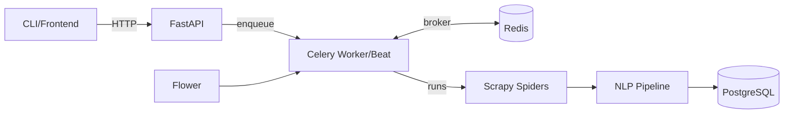

# Architecture Diagram

```mermaid
flowchart LR
  Client[CLI/Frontend] -->|HTTP| API[FastAPI]
  API -->|enqueue| Celery[Celery Worker/Beat]
  Celery <-->|broker| Redis[(Redis)]
  Celery -->|runs| Spiders[Scrapy Spiders]
  Spiders --> NLP[NLP Pipeline]
  NLP --> DB[(PostgreSQL)]
  Flower[Flower] --> Celery
```

This diagram illustrates request flow and async processing across FastAPI, Celery, Scrapy, NLP, Redis, and PostgreSQL.
